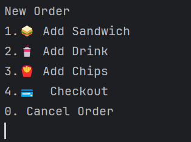
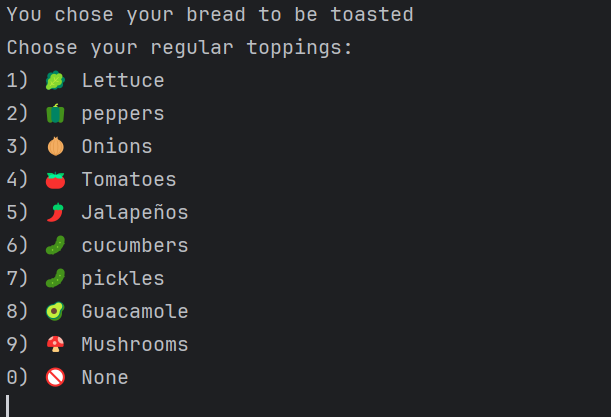
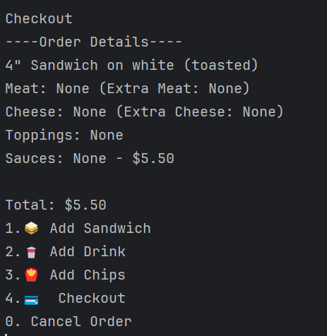

🍴 Forkcast
Forkcast is a command-line Java Point-of-Sale (POS) system for a custom sandwich shop.

Built as a fork of the DELI-cious app, it allows users to build sandwiches, add drinks and chips, and receive itemized receipts—all from a clean, user-friendly terminal interface.

⸻

🚀 Features

🥪 Sandwich Builder

	•	Choose bread type (white, wheat, rye, wrap)

	•	Select size (4”, 8”, 12”)

	•	Toast option

	•	Add meats, cheeses, regular toppings, and sauces

	•	Add extra meat and cheese (additional cost)

🍹 Drinks

	•	Choose size: small, medium, large

	•	Select from Coke, Sprite, Water, Iced Tea

🍟 Chips

	•	Choose from Doritos, Cheetos, Sunchips, Lays, Salt & Vinegar

	•	Add multiple bags

📃 Order Summary

	•	View itemized receipt with prices

	•	Total breakdown and tax

	•	Auto-saves receipt with timestamp

🥇 Signature Sandwiches

	•	BLT and Philly Cheese Steak templates

	•	Customizable after selection

🔁 Multiple Orders

	•	Start new order or exit after checkout

	•	Clears cart between sessions
 🖼 User Flow

🏠 Main Menu


🌿 New order Selection



🧀 Regular Topping Selection



🥤 Add Drink


🍟 Add Chips


✅ Checkout




```
```
Please chose your cheese topping? 
1) american
2) provolone
3) cheddar
4) swiss
0) None
```
```
Please chose your cheese topping? 
1) american
2) provolone
3) cheddar
4) swiss
0) None
```
```
Add Drink
Would you like a drink?
1) small ($2.00)
2) medium ($2.50)
3) Large ($3.00)
0) None
```
```
Choose a drink:
1) Coke
2) Sprite
3) Water
4) Iced Tea
0) Cancel
```
```
Add Chips
Choose a Chips:
1) Doritos
2) SunChips
3) Cheetos
4) Lays
5) Salt and Vinegar
0) Cancel
```
```
Add Chips
Choose a Chips:
1) Doritos
2) SunChips
3) Cheetos
4) Lays
5) Salt and Vinegar
0) Cancel
```
```
============================= 
        Your Order Summery: 
=============================
----Order Details----
Small Coke - $2.00

----------------------------- 
Total: $2.0
Thank you for your order!

1. New Order
0. Exit
```
```
DELI-cious/
├── com/
│   └── pluralsight/
│       ├── models/
│       │   ├── Order.java
│       │   ├── Sandwich.java
│       │   ├── Drink.java
│       │   ├── Chips.java
│       │   └── [SignatureSandwich].java       # Optional: BLT, PhillyCheeseSteak, etc.
│       │
│       ├── util/
│       │   └── ReceiptWriter.java
│       │
│       └── ui/
│           └── UserInterface.java             # Main interaction class
│
├── receipts/                                  # Automatically created; contains text receipts
│   └── 20250528-193421.txt                    # Example receipt with timestamp
│
├── README.md                                  # Project documentation
├── .gitignore                                 # Git config to ignore receipts, etc.
└── Main.java                                  # Entry point (calls UserInterface.mainMenu())
```
```

