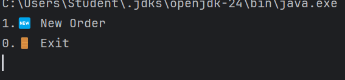

# Forkcast
DELI-cious is a Java-based, command-line Point-of-Sale (POS) system built for a custom sandwich shop.
It allows users to build and customize sandwiches, add drinks and chips, and generate detailed receipts for each order. 
Ideal for training and learning purposes, the app simulates a real-world deli ordering experience with a flexible menu system.

##Features
🥪 Custom Sandwich Builder
Choose bread type (white, wheat, rye, wrap)

Select bread size (4", 8", 12")

Option to toast the sandwich

Choose one or multiple meats

Add extra meat (additional cost)

Choose one or multiple cheeses

Add extra cheese (additional cost)

Select unlimited toppings (lettuce, tomato, onions, etc.)

Choose multiple sauces (mayo, mustard, ranch, etc.)

🍹 Add Drinks
Choose from available drink options (Coke, Sprite, etc.)

Select size (Small, Medium, Large)

🍟 Add Chips
Choose from chip options like Doritos, Cheetos, Sunchips, etc.

Add multiple chip bags to one order

📃 Order Summary and Receipt
View full itemized order summary

Shows total price with breakdown

Automatically generates and saves a receipt file

🥇 Signature Sandwiches (Bonus Feature)
Predefined sandwich templates:

BLT: Bacon, lettuce, tomato, cheddar, ranch, toasted

Philly Cheese Steak: Steak, American cheese, peppers, mayo, toasted

Users can still customize signature sandwiches

🔁 Multiple Orders
Start a new order or exit after completing one

Clears and resets current order on checkout




 
New Order
1. Add Sandwich
2. Add Drink
3. Add Chips
4. Checkout
0. Cancel Order

```
```
Add Sandwich
Select bread size  (4", 8" and 12" ?
1) 4 inch
2) 8 inch
3) 12 inch
```
```
Choose your regular toppings: 
1) Lettuce
2) peppers
3) Onions
4) Tomatoes
5) Jalapeños
6) cucumbers
7) pickles
8) Guacamole
9) Mushrooms
0) None

```
```
Please chose your cheese topping? 
1) american
2) provolone
3) cheddar
4) swiss
0) None
```
```
Please chose your cheese topping? 
1) american
2) provolone
3) cheddar
4) swiss
0) None
```
```
Add Drink
Would you like a drink?
1) small ($2.00)
2) medium ($2.50)
3) Large ($3.00)
0) None
```
```
Choose a drink:
1) Coke
2) Sprite
3) Water
4) Iced Tea
0) Cancel
```
```
Add Chips
Choose a Chips:
1) Doritos
2) SunChips
3) Cheetos
4) Lays
5) Salt and Vinegar
0) Cancel
```
```
Add Chips
Choose a Chips:
1) Doritos
2) SunChips
3) Cheetos
4) Lays
5) Salt and Vinegar
0) Cancel
```
```
============================= 
        Your Order Summery: 
=============================
----Order Details----
Small Coke - $2.00

----------------------------- 
Total: $2.0
Thank you for your order!

1. New Order
0. Exit
```
```
DELI-cious/
├── com/
│   └── pluralsight/
│       ├── models/
│       │   ├── Order.java
│       │   ├── Sandwich.java
│       │   ├── Drink.java
│       │   ├── Chips.java
│       │   └── [SignatureSandwich].java       # Optional: BLT, PhillyCheeseSteak, etc.
│       │
│       ├── util/
│       │   └── ReceiptWriter.java
│       │
│       └── ui/
│           └── UserInterface.java             # Main interaction class
│
├── receipts/                                  # Automatically created; contains text receipts
│   └── 20250528-193421.txt                    # Example receipt with timestamp
│
├── README.md                                  # Project documentation
├── .gitignore                                 # Git config to ignore receipts, etc.
└── Main.java                                  # Entry point (calls UserInterface.mainMenu())
```
```

